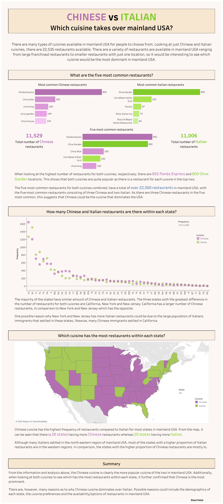

# Chinese vs Italian: Which Cuisine Dominates Mainland USA?

A Tableau dashboard analysing which cuisine has more restaurants across the mainland USA – Chinese or Italian.

---

## Overview
This project compares the number of Chinese and Italian restaurants in the US using data on frequency, top chains, and geographic distribution by state.

## Tools Used
- Tableau Public
- Excel (for cleaning and summaries)

## Key Insights
- Chinese cuisine has more restaurants overall (11,529 vs 11,006).
- Panda Express (Chinese) and Olive Garden (Italian) are the most common chains.
- Western states lean Chinese; northeastern states lean Italian.
- 28 states have more Chinese restaurants; 20 have more Italian.

## Live Dashboard
[View on Tableau Public](https://public.tableau.com/app/profile/diani.patel/viz/CHINESEvsITALIANWhichonetakesovermainlandUSA/ChinesevsItalian)

## Preview

